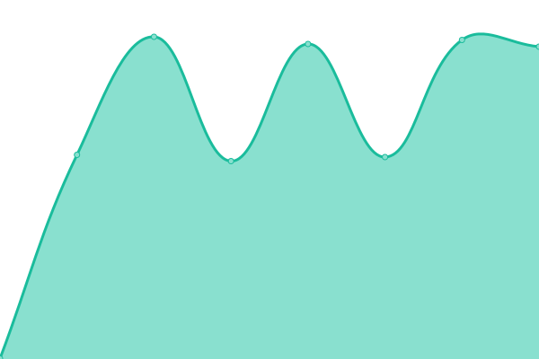
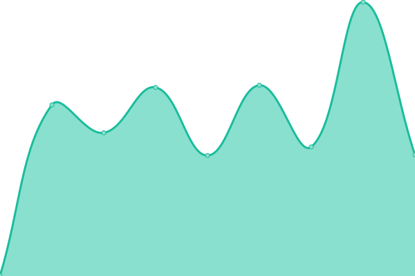
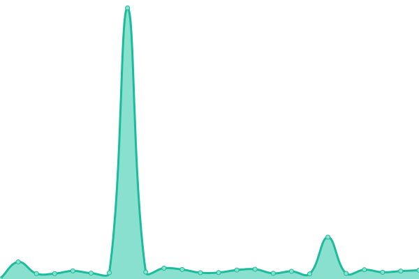

# [📈 Live Status](https://bacteriadb.com): <!--live status--> **🟧 Partial outage**

This repository contains the open-source uptime monitor and status page for [Suliman Sharif](https://www.sulstice.dev/), powered by [Upptime](https://github.com/upptime/upptime).

With [Upptime](https://upptime.js.org), you can get your own unlimited and free uptime monitor and status page, powered entirely by a GitHub repository. We use [Issues](https://github.com/Sulstice/Uptime-Bacteria/issues) as incident reports, [Actions](https://github.com/Sulstice/Uptime-Bacteria/actions) as uptime monitors, and [Pages](https://bacteriadb.com) for the status page.

<!--start: status pages-->
<!-- This summary is generated by Upptime (https://github.com/upptime/upptime) -->
<!-- Do not edit this manually, your changes will be overwritten -->
<!-- prettier-ignore -->
| URL | Status | History | Response Time | Uptime |
| --- | ------ | ------- | ------------- | ------ |
|  [European Molecular Biology Laboratory](https://www.ebi.ac.uk/) | 🟩 Up | [european-molecular-biology-laboratory.yml](https://github.com/Sulstice/Uptime-Bacteria/commits/HEAD/history/european-molecular-biology-laboratory.yml) | 

 1292ms
     
 | 

<a href="https://bacteriadb.com/history/european-molecular-biology-laboratory">100.00%</a>
    

|  [DDBJ bioinformatics](https://www.ddbj.nig.ac.jp/services/index-e.html) | 🟩 Up | [ddbj-bioinformatics.yml](https://github.com/Sulstice/Uptime-Bacteria/commits/HEAD/history/ddbj-bioinformatics.yml) | 

 2236ms
     
 | 

<a href="https://bacteriadb.com/history/ddbj-bioinformatics">100.00%</a>
    

|  [BROAD Institute](https://www.broadinstitute.org/data-software-and-tools) | 🟩 Up | [broad-institute.yml](https://github.com/Sulstice/Uptime-Bacteria/commits/HEAD/history/broad-institute.yml) | 

 489ms
     
 | 

<a href="https://bacteriadb.com/history/broad-institute">100.00%</a>
    

|  [ATCC](https://www.atcc.org/resources/application-notes/microbial-genome-databases) | 🟩 Up | [atcc.yml](https://github.com/Sulstice/Uptime-Bacteria/commits/HEAD/history/atcc.yml) | 

 734ms
     
 | 

<a href="https://bacteriadb.com/history/atcc">100.00%</a>
    

|  [Biocyc Genome Database](https://biocyc.org) | 🟩 Up | [biocyc-genome-database.yml](https://github.com/Sulstice/Uptime-Bacteria/commits/HEAD/history/biocyc-genome-database.yml) | 

 494ms
     
 | 

<a href="https://bacteriadb.com/history/biocyc-genome-database">100.00%</a>
    

|  [National Center for Bioinformatics Microbial Genome Database](https://www.ncbi.nlm.nih.gov/genome/microbes/) | 🟩 Up | [national-center-for-bioinformatics-microbial-genome-database.yml](https://github.com/Sulstice/Uptime-Bacteria/commits/HEAD/history/national-center-for-bioinformatics-microbial-genome-database.yml) | 

 493ms
     
 | 

<a href="https://bacteriadb.com/history/national-center-for-bioinformatics-microbial-genome-database">100.00%</a>
    

|  [Ensembl Bacteria](https://bacteria.ensembl.org/species.html) | 🟩 Up | [ensembl-bacteria.yml](https://github.com/Sulstice/Uptime-Bacteria/commits/HEAD/history/ensembl-bacteria.yml) | 

 1839ms
     
 | 

<a href="https://bacteriadb.com/history/ensembl-bacteria">100.00%</a>
    

|  [EzBioCloud Public Genome](https://www.ezbiocloud.net/genome/list?tn=Root) | 🟩 Up | [ez-bio-cloud-public-genome.yml](https://github.com/Sulstice/Uptime-Bacteria/commits/HEAD/history/ez-bio-cloud-public-genome.yml) | 

 834ms
     
 | 

<a href="https://bacteriadb.com/history/ez-bio-cloud-public-genome">100.00%</a>
    

|  [NIH Human Microbiome Project](https://www.hmpdacc.org/hmp/) | 🟩 Up | [nih-human-microbiome-project.yml](https://github.com/Sulstice/Uptime-Bacteria/commits/HEAD/history/nih-human-microbiome-project.yml) | 

 865ms
     
 | 

<a href="https://bacteriadb.com/history/nih-human-microbiome-project">100.00%</a>
    

|  [Microbial Genome Database](https://mbgd.nibb.ac.jp/) | 🟩 Up | [microbial-genome-database.yml](https://github.com/Sulstice/Uptime-Bacteria/commits/HEAD/history/microbial-genome-database.yml) | 

 1529ms
     
 | 

<a href="https://bacteriadb.com/history/microbial-genome-database">100.00%</a>
    

|  [JGI Genomes](https://gold.jgi.doe.gov/) | 🟩 Up | [jgi-genomes.yml](https://github.com/Sulstice/Uptime-Bacteria/commits/HEAD/history/jgi-genomes.yml) | 

 1544ms
     
 | 

<a href="https://bacteriadb.com/history/jgi-genomes">100.00%</a>
    

|  [Pseudomonas Genome Database](https://www.pseudomonas.com/) | 🟩 Up | [pseudomonas-genome-database.yml](https://github.com/Sulstice/Uptime-Bacteria/commits/HEAD/history/pseudomonas-genome-database.yml) | 

 2085ms
     
 | 

<a href="https://bacteriadb.com/history/pseudomonas-genome-database">100.00%</a>
    

|  [Ecocyc](https://www.ecocyc.org/) | 🟩 Up | [ecocyc.yml](https://github.com/Sulstice/Uptime-Bacteria/commits/HEAD/history/ecocyc.yml) | 

 433ms
     
 | 

<a href="https://bacteriadb.com/history/ecocyc">100.00%</a>
    

|  [ECMDB](https://ecmdb.ca/) | 🟥 Down | [ecmdb.yml](https://github.com/Sulstice/Uptime-Bacteria/commits/HEAD/history/ecmdb.yml) | 

 0ms
     
 | 

<a href="https://bacteriadb.com/history/ecmdb">100.00%</a>
    

|  [Staphylococcus regulator RNA Database](http://srd.genouest.org/#) | 🟩 Up | [staphylococcus-regulator-rna-database.yml](https://github.com/Sulstice/Uptime-Bacteria/commits/HEAD/history/staphylococcus-regulator-rna-database.yml) | 

 930ms
     
 | 

<a href="https://bacteriadb.com/history/staphylococcus-regulator-rna-database">100.00%</a>
    

|  [Vibrio Cholera Genome Database](https://vibrio.biocyc.org/) | 🟩 Up | [vibrio-cholera-genome-database.yml](https://github.com/Sulstice/Uptime-Bacteria/commits/HEAD/history/vibrio-cholera-genome-database.yml) | 

 546ms
     
 | 

<a href="https://bacteriadb.com/history/vibrio-cholera-genome-database">100.00%</a>
    

<!--end: status pages-->

[**Visit our status website →**](https://bacteriadb.com)

## 📄 License

- Powered by: [Upptime](https://github.com/upptime/upptime)
- Code: [MIT](./LICENSE) © [Suliman Sharif](https://www.sulstice.dev/)
- Data in the `./history` directory: [Open Database License](https://opendatacommons.org/licenses/odbl/1-0/)
